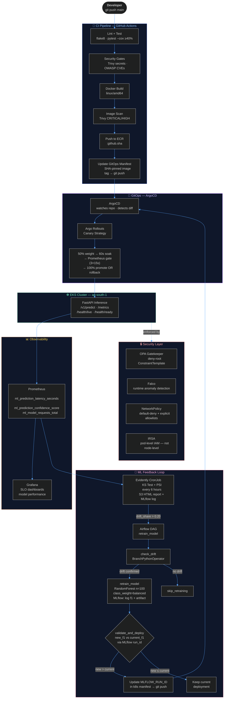

<div align="center">


[](https://git.io/typing-svg)

<br/>

[](https://github.com/AdilQuantum/nexus-mlops-platform/actions)
[](https://aws.amazon.com/eks/)
[](https://terraform.io)
[](https://argoproj.github.io/)
[](https://fastapi.tiangolo.com/)
[](https://mlflow.org/)
[](#security-model)
[](https://aws.amazon.com/)

</div>

---

## What This Is

Nexus is a **self-healing ML inference platform** built on AWS EKS. It treats every model deployment as a production engineering problem — not a data science problem.

Every component in this system is wired together: the CI pipeline writes the image tag into the GitOps manifest, ArgoCD syncs it, Argo Rollouts gates on Prometheus before promoting, Evidently watches the live distribution, drift triggers Airflow, Airflow runs the champion/challenger gate against MLflow, and a passing challenger writes itself back into the manifest. The loop closes without human intervention.

This is not a notebook. This is not a demo. This runs on spot nodes with real security gates on every commit.

---

## Architecture



---

## Tech Stack

| Layer | Technology | Decision rationale |
|-------|-----------|-------------------|
| **Infrastructure** | Terraform (modular) | Module boundary = blast radius boundary; reproducible destroy/apply cycle |
| **Compute** | AWS EKS 1.30 · t3.medium spot | Managed control plane; spot gives 60–70% node cost reduction |
| **Network** | VPC · NAT Gateway · private subnets | Workload nodes never directly internet-reachable |
| **GitOps delivery** | ArgoCD | Git is sole source of truth; no imperative kubectl in production |
| **Canary** | Argo Rollouts + Prometheus AnalysisTemplate | Auto-rollback if pod readiness gate fails within 3 checks |
| **Inference** | FastAPI + Pydantic · Prometheus client | Typed, async-ready; metrics embedded, not bolted on |
| **Model store** | MLflow on PostgreSQL 16.6 (RDS) | Persistent experiment store; artifact root on S3 |
| **Drift detection** | Evidently AI — KS test + PSI | Distribution-level drift on 5 features; not just label shift |
| **Retraining** | Apache Airflow DAG | Native branching: check_drift → retrain → champion/challenger |
| **Auth** | IRSA + GitHub Actions OIDC | No static credentials anywhere; pod-scoped IAM, not node-scoped |
| **Security gates** | Trivy · OWASP · OPA Gatekeeper · Falco | Shift-left from commit (Trivy) through admission (OPA) through runtime (Falco) |
| **Observability** | Prometheus + Grafana kube-prometheus-stack | Custom ML metrics; SLO dashboards; PrometheusRule ML alerts |
| **Load testing** | k6 | Ramp-up profile; P95 latency SLO verification |

---

## Key Engineering Decisions

### 1. IRSA over node-level IAM

Every pod that touches S3 or ECR is bound to a dedicated IAM role via IRSA. If the inference pod is compromised, the attacker's blast radius is scoped to that pod's role — not the instance profile covering all workloads on the node. Least privilege enforced at the pod boundary, not the cluster boundary.

### 2. Canary with a Prometheus quality gate instead of blue/green

Blue/green is instant and all-or-nothing. If the new model image is broken, 100% of traffic sees it before any rollback can happen. Argo Rollouts canary holds 50% for 60 seconds, then queries Prometheus — `scalar(sum(kube_pod_container_status_ready{container="inference"})) >= 1` across 3 checks at 15-second intervals — before promoting. Failure triggers automatic rollback with zero manual intervention.

### 3. SHA-pinned image tags in GitOps manifests

`latest` is not a deployment strategy. The CI pipeline commits the full `github.sha` into `gitops/rollouts/inference-canary.yaml` and pushes. ArgoCD detects the diff and syncs. Every deployment is traceable to the exact commit that produced it, with no tag mutation possible.

### 4. Champion/challenger F1 gate before model promotion

Retraining automatically does not mean deploying automatically. The Airflow `validate_and_deploy` task pulls the current production model's F1 from MLflow by `MLFLOW_RUN_ID`, compares against the newly retrained model, and only updates the manifest if the challenger beats the champion. A model that regresses on the test set does not get promoted regardless of how much drift triggered the retrain.

### 5. Default-deny NetworkPolicy with explicit allowlists

The cluster runs a blanket default-deny on all ingress and egress. The `allow-inference` NetworkPolicy opens only the paths that are operationally required: inference → MLflow (model load at startup), inference → Prometheus (scrape target), Airflow → MLflow (artifact logging). Everything else is blocked at the kernel level.

### 6. Spot instances with stateless inference

Inference is stateless — the model is loaded from MLflow/S3 at pod startup. This makes it safe to run on spot instances that can be reclaimed with a 2-minute warning. The node termination handler drains the node gracefully before EC2 reclaims it. Running stateful workloads (RDS, MLflow backend) on on-demand preserves the cost advantage without sacrificing reliability.

---

## Repository Structure

```
nexus-mlops-platform/
│
├── .github/workflows/
│   └── main.yaml                    # lint-test → security-scan → build-push (on main)
│
├── infrastructure/
│   ├── modules/
│   │   ├── vpc/                     # NAT Gateway, public/private subnets, subnet tags
│   │   ├── eks/                     # v1.30 cluster, spot t3.medium node group
│   │   ├── iam/                     # Cluster + node roles, OIDC provider, IRSA trust
│   │   ├── rds/                     # PostgreSQL 16.6 MLflow backend store
│   │   ├── s3/                      # Model artifact bucket, drift HTML reports
│   │   ├── ecr/                     # Container registry (force_delete=true)
│   │   └── security-groups/         # Cluster SG, node SG, RDS SG
│   └── environments/
│       ├── staging/                 # ap-south-1, t3.medium spot
│       └── production/
│
├── ml/
│   ├── training/
│   │   ├── train.py                 # RandomForest fraud detection; MLflow experiment tracking
│   │   └── test_train.py            # Pytest — CI coverage gate ≥40%
│   ├── inference/
│   │   ├── app.py                   # FastAPI: /v1/predict · /metrics · /health/*
│   │   ├── Dockerfile               # linux/amd64, non-root user
│   │   └── requirements.txt
│   ├── drift/
│   │   └── detector.py              # Evidently KS+PSI; S3 upload; Airflow REST trigger
│   └── dags/
│       └── retrain_dag.py           # Airflow DAG: check_drift → retrain → validate_and_deploy
│
├── gitops/
│   ├── apps/
│   │   └── inference-service.yaml   # ArgoCD Application CRD
│   └── rollouts/
│       ├── inference-canary.yaml    # Argo Rollout: 50% → 60s soak → Prometheus gate → 100%
│       └── analysis-template.yaml  # PromQL: scalar(sum(kube_pod_container_status_ready))
│
├── k8s/
│   ├── mlflow-deployment.yaml       # MLflow tracking server + Service + PVC
│   ├── evidently-cronjob.yaml       # Drift CronJob — schedule: "0 */6 * * *"
│   ├── prometheus-rules.yaml        # Custom PrometheusRule for ML metrics
│   ├── train-job.yaml               # One-off training Job
│   ├── train-configmap.yaml         # Training script ConfigMap
│   └── airflow-values.yaml          # Helm values: executors, pip packages, DAG sync
│
├── security/
│   ├── opa-policies/
│   │   └── deny-root.yaml           # OPA Gatekeeper ConstraintTemplate + Constraint
│   ├── network-policies/
│   │   ├── default-deny.yaml        # Blanket deny all ingress + egress
│   │   └── allow-inference.yaml     # Allowlist: inference ↔ MLflow ↔ Prometheus
│   └── falco-rules/
│       └── custom-rules.yaml        # Runtime anomaly detection rules
│
└── observability/
    ├── dashboards/
    │   └── model-performance.json   # Grafana: P95 latency, confidence dist, drift score
    └── alerts/
        └── ml-alerts.yaml           # PrometheusRule: high error rate, low confidence
```

---

## CI/CD Pipeline

```
git push → main
│
├── [lint-test]
│   ├── flake8 ml/ --max-line-length=100
│   └── pytest ml/training/test_train.py --cov=ml/training --cov-fail-under=40
│
├── [security-scan]  ← needs: lint-test
│   ├── Trivy filesystem  → secret detection, exit-code: 1
│   └── OWASP Dependency-Check → HTML artifact upload
│
└── [build-push]  ← needs: security-scan, main branch only
    ├── OIDC → assume nexus-mlops-github-actions-role (no static credentials)
    ├── ECR login
    ├── docker build --platform linux/amd64 ml/inference/
    ├── Trivy image scan → CRITICAL/HIGH report artifact (exit-code: 0, non-blocking)
    ├── docker push :$GITHUB_SHA
    └── sed SHA into gitops/rollouts/inference-canary.yaml
        └── git commit -m "ci: update inference image to $SHA" && git push
            └── ArgoCD detects diff → triggers sync
```

---

## Inference API

**Base URL:** `http://<inference-service>:8000`

```
POST /v1/predict
Content-Type: application/json

{
  "features": [245.50, 14, 890, 3, 67.2]
}

→ 200 OK
{
  "prediction": 0,
  "confidence": 0.91,
  "model_version": "1.0.0"
}
```

| Endpoint | Purpose |
|---------|---------|
| `POST /v1/predict` | Model inference — features array → prediction + confidence |
| `GET /metrics` | Prometheus scrape endpoint |
| `GET /health/live` | Liveness probe — always 200 if process is up |
| `GET /health/ready` | Readiness probe — 503 if model not loaded |

**Prometheus metrics emitted:**
```
ml_prediction_latency_seconds{quantile="0.5|0.9|0.95|0.99"}
ml_prediction_confidence_score
ml_model_requests_total{status="success|error"}
```

---

## ML Feedback Loop

```
FastAPI /v1/predict
    │
    ├── PREDICTION_LATENCY.observe(latency)       ← Histogram
    ├── PREDICTION_CONFIDENCE.set(confidence)     ← Gauge
    └── REQUEST_COUNTER.labels(status).inc()      ← Counter
            │
            ▼
    Prometheus ←── scrapes /metrics every 15s
            │
            ▼
    Grafana model-performance dashboard
            │
            ▼
    Evidently CronJob  (schedule: 0 */6 * * *)
    ├── reference: training distribution (n=1000, seed=42)
    ├── current:   live distribution     (n=500,  seed=99)
    ├── Report(metrics=[DataDriftPreset()])
    ├── drift_share logged → MLflow run (tag: component=drift-detection)
    ├── HTML report → S3: drift-reports/drift_report_YYYYMMDD_HHMMSS.html
    └── drift_share > 0.20
            │
            ▼
    POST /api/v1/dags/retrain_model/dagRuns  {"triggered_by": "drift_detection"}
            │
            ▼
    Airflow DAG: retrain_model
    ├── check_drift (BranchPythonOperator)
    │   └── reads latest drift-detection run from MLflow
    │       ├── drift_share > 0.20 → retrain_model
    │       └── drift_share ≤ 0.20 → skip_retraining
    ├── retrain_model (PythonOperator)
    │   ├── RandomForest(n_estimators=100, max_depth=6, class_weight=balanced)
    │   ├── mlflow.log_metric("f1_score", f1)
    │   └── mlflow.log_artifact("model.pkl")  → xcom: new_run_id, new_f1
    └── validate_and_deploy (PythonOperator)
        ├── current_f1 = MLflow.get_run(CURRENT_MLFLOW_RUN_ID).metrics["f1_score"]
        ├── new_f1 > current_f1 → update MLFLOW_RUN_ID in k8s manifest → git push → ArgoCD
        └── new_f1 ≤ current_f1 → keep current deployment (logged to MLflow)
```

---

## Security Model

| Control | Implementation | Gate |
|--------|---------------|------|
| Secret scanning | Trivy filesystem — exit 1 on finding | Pre-merge |
| Dependency CVEs | OWASP Dependency-Check HTML report | Pre-merge |
| Container image CVEs | Trivy CRITICAL/HIGH on built image | Pre-push |
| No static AWS credentials | GitHub Actions OIDC → assume role | CI runtime |
| Pod privilege escalation | OPA Gatekeeper `deny-root` ConstraintTemplate | Admission |
| Runtime threats | Falco custom rules — anomaly detection | Runtime |
| Network isolation | Default-deny NetworkPolicy + explicit allowlists | Runtime |
| Pod-scoped IAM | IRSA — per-pod role, not per-node | Runtime |
| Image integrity | SHA-pinned tags in GitOps manifest, never `latest` | Deployment |

---

## Infrastructure

```bash
# Full stack (33 resources, ~4 min)
cd infrastructure/environments/staging
terraform init && terraform apply

# Targeted iteration (faster on partial errors)
terraform apply -target="module.vpc"
terraform apply -target="module.eks"
terraform apply -target="module.rds"

# Always destroy after session — NAT Gateway alone is $0.045/hr
terraform destroy
```

| Resource | $/hour |
|----------|--------|
| NAT Gateway | $0.045 |
| EKS control plane | $0.100 |
| EC2 spot nodes (t3.medium ×2) | $0.050 |
| RDS PostgreSQL 16.6 | $0.018 |
| **Total** | **~$0.21** |

---

## Helm Stack — Install Order

```bash
# 1. ArgoCD
kubectl create namespace argocd
helm repo add argo https://argoproj.github.io/argo-helm
helm install argocd argo/argo-cd --namespace argocd

# 2. Argo Rollouts
kubectl create namespace argo-rollouts
helm install argo-rollouts argo/argo-rollouts --namespace argo-rollouts

# 3. Prometheus + Grafana
helm repo add prometheus-community https://prometheus-community.github.io/helm-charts
helm install prometheus prometheus-community/kube-prometheus-stack \
  --namespace monitoring --create-namespace \
  --set grafana.adminPassword=admin123

# 4. Airflow
helm repo add apache-airflow https://airflow.apache.org
helm install airflow apache-airflow/airflow \
  --namespace airflow --create-namespace \
  -f k8s/airflow-values.yaml

# 5. MLflow (manifest, not Helm)
kubectl apply -f k8s/mlflow-deployment.yaml

# 6. Deploy via GitOps
kubectl apply -f k8s/argocd-app.yaml
```

---

## Prerequisites

```
terraform  >= 1.10.0
kubectl    >= 1.28
helm       >= 3.14
aws cli    >= 2.x    (configured: ap-south-1, adil-admin)
docker     >= 24.x   (buildx enabled for linux/amd64)
```

---

## What's Next

- [ ] Horizontal Pod Autoscaler on inference — CPU + `ml_model_requests_total` custom metric
- [ ] Cosign image signing in CI — attest SHA → ECR before GitOps commit
- [ ] Grafana Loki — log aggregation across inference, drift, and Airflow pods
- [ ] k6 SLO gate in CI — P95 < 200ms blocks merge, not just reports
- [ ] Kafka feature stream → online feature store → real live distribution for Evidently
- [ ] SonarCloud quality gate on ML training code

---

<div align="center">

Built by **Adil** — Cloud Security & MLOps Engineer · ap-south-1

[](https://github.com/AdilQuantum)


</div>
